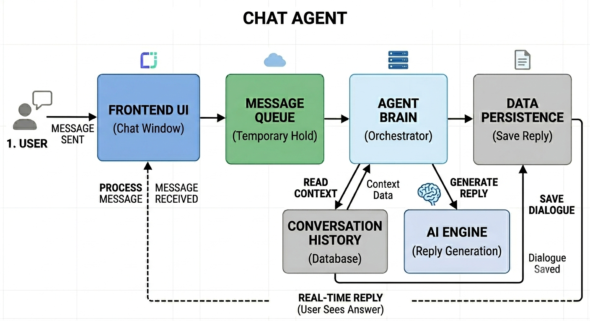

# AI Chat Agent Architecture

The architecture uses an Ingestion Service (Gateway), a BullMQ background worker tier running on Redis, a PostgreSQL database (Supabase) via Sequelize ORM, and a responsive React frontend interface.

### Ingestion Serivce:
* User clicks Send: The Frontend updates your screen instantly and hits your Ingestion Service.
* The Ingestion Service takes the message and immediately pushes a job into the Redis Queue (BullMQ). It then holds the user's browser connection open (Long-Polling), waiting for an update.

### Worker Service
* Picking up the Job: The Node.js Worker pulls the message from the Redis queue.
* Before calling LLM, the worker queries your Database (Supabase) to get the last 10 messages of the conversation.
* The worker packages your new message + the past history together and sends it to the LLM API. This way, the AI knows the full context of your conversation.

### Final Stage
* The AI sends the reply back to the worker. The worker immediately writes this new AI response to your Database so it’s saved forever.

Here is the simple architecture diagram of the flow:



_______________________________


# Local Setup

* **Node.js** (22.14 version is used by me)
* **Redis Instance** (used cloud hosted uptash)
* **PostgreSQL Database** (Used Supabase)

* ### Step 1: Clone and Install Dependencies
Navigate to each repository tier and install the node dependencies:

```bash or cmd
# From the root directory
cd ingestion-service && npm install
cd ../worker-service && npm install
cd ../frontend && npm install
```

* ### Step 2: Environment Configuration
Create a .env file in both ingestion-service and worker-service directories based on the templates below.

ingestion-service/.env
```
PORT=3000
DATABASE_URL=your_supabase_postgresql_connection_string
REDIS_URL=your_redis_connection_url

```
worker-service/.env
```
DATABASE_URL=your_supabase_postgresql_connection_string
REDIS_URL=your_redis_connection_url
GEMINI_API_KEY=your_google_gemini_api_key or any other LLM

```
* ### Step 3: Database Setup (Migrations & Sync)
I have utilized Sequelize ORM with automated schema synchronization.

There are no manual SQL scripts or migrations to run.

Upon starting the ingestion-service or worker-service, Sequelize will automatically verify connection integrity, build the conversations and messages tables, and align the column data types in your Supabase instance.

* ### Step 4: Run the Application
```
# Terminal 1: Ingestion Gateway
cd ingestion-service && npm run dev

# Terminal 2: Background Worker Processing Engine
cd worker-service && npm run dev

# Terminal 3: React Frontend Client
cd frontend && npm run dev

```

* ### Step 5: Few things
  
* Currently since there is no user login , if you want to create a new chat session then "Go to frontend folder-->src-->ChatWindow.tsx --> look at the starting only, you will see const sessionId = "spur_test_session_2"; You can change it to any name and save then a new session will be created.

* For redis signup go to uptash, create your account, Create database and from there you can copy the url for your redis env variable

* For Postgres database, go to Supabase, signin, create project, go to project overview , under get connected click ORM, prisma, choose second url for envrionment variable.
_________________________________

### LLM Implementation & Guardrails
Provider
Model: Google Gemini (via the formal new @google/genai SDK package).

Selection Reason: I already had an api key for it so thats why.

### Prompting Strategy

The model behavior is isolated entirely through the SDK's structural systemInstruction configurations:

"You are a helpful customer support agent for Spur. Keep answers concise, factual, and professional."

I checked with multiple messages, the response were logical shot and precise.

### Trade-offs & "If I had more time...

* I would have implemented user login to have a seperate session for each user for isolation and security.
* I would have implemented WebSockets instead of long polling to establish a better bidirectional connection, enabling faster responses (with many users load long polling will be much slower) and reducing server load.

# Other things
This assesment is hosted on Render's free tier and utilizes the free-tier API for Gemini 2.5 Flash. Few things might happen:

* If the application has been inactive, the background worker and Redis instances may take up to 30 seconds to spin up on the initial request.
* During periods of high traffic on Google's Gemini servers, response generation times may increase, occasionally leading to request timeouts. Refreshing the chat interface will load the completed response directly from the database once processing finishes.

